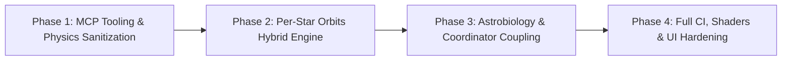

# AetherGenesis Master Codebase Audit & Architectural Blueprint — August 21, 2026

**Authoritative Multi-Agent Consolidation**: 100% line-by-line coverage across all 46 files (11,593 lines). Supersedes all prior audit documents.

---

## 1. Complete Coverage Ledger (100% Exhaustive Accounting — 46 files, 11,593 lines)

| Subsystem | Files & Line Counts | Status | Verified Domains |
| :--- | :--- | :--- | :--- |
| **Physics & Orbital Mechanics** | `StellarPhysics.ts` (503) · `OrbitalMechanics.ts` (147) · `nbodyWorker.ts` (258) · `SimulationCoordinator.ts` (236) · `AstrobiologyEngine.ts` (189) | **100% Audited** | Mass-luminosity scaling, IFMR, Störmer-Verlet integrator, vis-viva back-calculation, Kopparapu habitable zone boundaries, biogenesis timers. |
| **Rendering Systems & Scene Graph** | `engine.ts` (548) · `HeroStarSystem.ts` (726) · `PlanetarySystem.ts` (518) · `CometSystem.ts` (329) · `AsteroidBeltSystem.ts` (82) · `DysonSwarmSystem.ts` (53) · `NebulaSystem.ts` (197) | **100% Audited** | Instanced mesh rendering, per-star orbit distribution, point-light culling, sweep-and-prune star repulsion, asset queues. |
| **Evolution Phases** | `MainSequencePhase.ts` (259) · `RedGiantPhase.ts` (186) · `NebulaPhase.ts` (142) · `ProtostarPhase.ts` (172) · `SupernovaPhase.ts` (143) · `RemnantPhase.ts` (338) | **100% Audited** | Shader caching (`customProgramCacheKey`), Kelvin-Helmholtz contraction, Herbig-Haro jets, Doppler beaming accretion disk, pulsar beams, lifecycle disposal. |
| **Pipeline, Shaders & Audio** | `pipeline.ts` (120) · `stellar.ts` (44) · `physics/math.ts` (49) · `utils/math.ts` (13) · `utils/security.ts` (23) · `utils/performance.ts` (39) · `utils/shaderLoader.ts` (20) · `AudioEngine.ts` (152) · GLSL shaders | **100% Audited** | Post-processing cinematic pass, gravitational lensing, point size fill-rate limits, Web Audio graph leaks, Planckian locus blackbody colors. |
| **Model Context Protocol (MCP)** | `server/mcp/sim-state.mjs` (267) · `server/mcp/nasa-horizons.mjs` (425) · `server/mcp/stellar-catalog.mjs` (697) | **100% Audited** | Stdio JSON-RPC tools, SIMBAD ADQL generation, MK spectral parsing, Horizons small-body fallbacks, token authentication. |
| **Hooks, UI & Server** | `useSimulation.ts` (636) · `usePerformanceAutoTuning.ts` (381) · `useStarSelection.ts` (72) · `useCosmicAge.ts` (57) · `useWebSocket.ts` (81) · `useKeyboardShortcuts.ts` (108) · `AstrobiologyPanel.tsx` (189) · `CatalogPanel.tsx` (267) · `ConstantsPanel.tsx` (271) · `InspectPanel.tsx` (350) · `Hud.tsx` (622) · `AetherGenesis.tsx` (148) · `SimStateSocket.ts` (272) · `server.ts` (1066) | **100% Audited** | React state synchronization, async race conditions (`AbortController`), WebSocket reconnection & subprotocol RFC 6455 compliance, memory leaks. |

---

## 2. Comprehensive Findings Catalog

### 🚨 FINDING #1: Per-Star Orbits Root Architecture Defect
- **Files**: `nbodyWorker.ts:4-257`, `useSimulation.ts:325-365`, `engine.ts:307, 412-423`, `HeroStarSystem.ts:501, 512`, `PlanetarySystem.ts:344-403`.
- **Root Cause**:
  1. `useSimulation` initializes a single Web Worker (`nbodyWorker.ts`) seeded with 3 hardcoded bodies (`earth`, `jupiter`, `halley`) around a fixed mass $M_{\text{central}} = 1.0\,M_\odot$.
  2. `Engine.update()` passes the **identical `nbodyBuffer`** into every `HeroStarSystem` in the galaxy (100–600 stars). Every star in Main Sequence or Red Giant renders identical planetary clones with the exact same orbital radii, phase angles, and velocities.
  3. `CometSystem` and `AsteroidBeltSystem` are singletons anchored only to `selectedStar || heroStars[0]`.
  4. `addBodyToSimulation` computes initial velocity for the selected star's mass $M_\star$, but the worker integrates it under $1.0\,M_\odot$, causing unbound trajectories on non-solar stars.

```mermaid
flowchart TD
    subgraph Current_Architecture["Current Architecture: Global Buffer Clone"]
        W[Single Worker: M = 1.0 M☉] -->|nbodyBuffer| E[Engine.update]
        E -->|Clone| S1["Star 0 (0.2 M☉): Cloned 3-body system"]
        E -->|Clone| S2["Star 1 (1.0 M☉): Cloned 3-body system"]
        E -->|Clone| S3["Star N (20.0 M☉): Cloned 3-body system"]
    end
    
    subgraph Target_Architecture["Target Architecture: Hybrid Engine"]
        Worker["Dynamic nbodyWorker: M = M_selected"] -->|Live Float32Array| FocusedStar["Selected Star (N-Body + Astrobiology)"]
        Proc["Procedural Keplerian Solver O(1)"] -->|T = 2pi * sqrt(a^3 / GM_star)| BgStars["99-599 Background Stars (Unique Orbits)"]
    end
```

---

### 🚨 FINDING #2: Vis-Viva Equation Corruption & Astrobiology Disruption
- **Files**: `SimulationCoordinator.ts:141-146`, `AstrobiologyEngine.ts:114-125`.
- **Mathematical Breakdown**:
  $$\frac{1}{a} = \frac{2}{r} - \frac{v^2}{4\pi^2 M_\star}$$
  The coordinator evaluates coordinates generated by the worker under $M=1.0\,M_\odot$ against the selected star's mass $M_\star$:
  - **Low-Mass Stars ($M_\star = 0.4\,M_\odot$)**: $\text{invA} = 2.0 - \frac{4\pi^2}{1.6\pi^2} = -0.5 \implies a = 9999\,\text{AU}$. $S_{\text{eff}} \approx 0 \implies$ Permanent snowball extinction ($0\,\text{K}$).
  - **High-Mass Stars ($M_\star = 20\,M_\odot$, $L = 160,000\,L_\odot$)**: $\text{invA} = 2.0 - 0.05 = 1.95 \implies a = 0.513\,\text{AU}$. $S_{\text{eff}} \approx 608,400\,S_\odot \implies T_{\text{surf}} > 7,500\,\text{K}$ (atmosphere instantly incinerated).
- **Astrobiology Zeroing Reset**:
  `compositeScore = orbital * thermal * atmosphere * stellarActivity * age`.
  If `compositeScore \le 0.65` for even **one tick** due to eccentric orbit jitter, `timeInHz_yr` is wiped to 0, destroying eons of evolutionary progress.

---

### 🚨 FINDING #3: MCP Dev-Tooling Vulnerabilities & Bugs (`server/mcp/*.mjs`)
- **`stellar-catalog.mjs:346-353` (🚨 Critical)**:
  `cleanSp.includes('I')` luminosity class matching wrongly treats Subgiants (`IV`), Bright Giants (`II`), Subdwarfs (`VI`), and White Dwarfs (`VII`) as Supergiants ($\times 100$ radius, $\times 10$ mass).
- **`stellar-catalog.mjs:565-575` (🚨 Critical)**:
  `get_star_by_name` lacks a 404 return path; unmatched stars or zero-row SIMBAD queries silently hallucinate the Sun's physical profile labeled under the requested name.
- **`stellar-catalog.mjs:580, 593` (⚠️ Low)**:
  `spClass` is sanitized twice via `sanitizeAdql()`, mangling queries containing apostrophes.
- **`nasa-horizons.mjs:377-397` (⚠️ Medium)**:
  When `type === 'all'`, offline fallback only returns comets and drops all asteroid presets. Fallback records lack `source: 'cached_fallback'` metadata.
- **`sim-state.mjs:132-147, 217-249` (⚠️ Medium)**:
  `trigger_simulation_event` description claims tool is disabled by default for safety, but executes mutative events unconditionally. `!latestState` check blocks event execution if socket is open before initial broadcast.
- **MCP Test Deficit (🚨 High)**:
  0 unit or integration tests exist in the repository for any of the 3 stdio MCP servers.

---

### ⚠️ FINDING #4: Stellar Evolution Phases & Scene Graph Leaks
- **Missing `customProgramCacheKey`**:
  - `RemnantPhase.ts:58-99` (`beamMat` pulsar beam shader).
  - `NebulaSystem.ts:153-164` (background nebula particles).
- **Point Size Unbounded Attenuation**:
  `NebulaSystem.ts:23`, `particle.vert.glsl:7`, `ejecta.vert.glsl:8`, `engine.ts:194` lack a lower clamp on $-mvPosition.z$, causing point size explosion and GPU fill-rate collapse near the camera.
- **Remnant Opacity Stepping Bug**:
  `HeroStarSystem.ts:71, 649` defines `_opNs = 0` but never updates it, causing `RemnantPhase.updateRemnantOpacity()` to be skipped during exit transitions.
- **Supernova Phase Desync**:
  `SupernovaPhase.ts:54, 77` adds `snRing` and `ejectaMesh` to `parent` rather than `supernovaGroup`, causing them to bypass group-level visibility toggles.
- **Step Discontinuity at Red Giant Onset**:
  `StellarPhysics.ts:128-130` jumps $100\times$ in radius at $\text{age} = \tau_{\text{MS}}$, whereas `RedGiantPhase.ts` smoothly expands $1\times \to 7\times$.

---

### ⚠️ FINDING #5: Rendering Pipeline, Shaders & Web Audio Leaks
- **Pipeline GC Thrashing (`pipeline.ts:41, 48`)**:
  `new THREE.Vector2(0.5, 0.5)` and `new THREE.Vector3()` are allocated inside `updateLensing()` every frame (60–120Hz).
- **Lensing Projection Guard (`pipeline.ts:53`)**:
  `tempV.z <= 1.0` fails to guard against objects behind the camera ($w < 0$), generating phantom gravitational lensing artifacts.
- **Web Audio Node Leaks (`AudioEngine.ts:102-137`)**:
  Oscillator and gain nodes are stopped but never disconnected via `.disconnect()`, leaking Web Audio graph nodes. `AudioContext` fails silently on UI clicks if mute toggle wasn't clicked first.
- **Inverted Performance Tier Logic (`utils/performance.ts:22-25`)**:
  Workstations with 16-core CPUs and DPR 1 are capped at `high`, while mobile devices with 8 ARM cores and DPR 2+ are overloaded with `ultra` (600 stars).

---

### ⚠️ FINDING #6: React Hooks & UI Race Conditions
- **Asynchronous Race Conditions**:
  - `InspectPanel.tsx:125-174`: AI Deep Scan lacks `AbortController` and star ID validation; stale Gemini responses overwrite newer star selections.
  - `CatalogPanel.tsx:45-77`: Star and Horizons searches lack cancellation, allowing out-of-order network responses to overwrite active search state.
- **WebSocket Port Bug (`useWebSocket.ts:18-21`)**:
  Forces port `3001` whenever `!port` is true, breaking production deployments over standard HTTPS (`""` port).
- **Stellar Scrub Desync (`useStarSelection.ts:36-45`)**:
  Directly mutates `selectedStarRef.current.t` without triggering React state re-renders.
- **Unmanaged UI Timers & Missing Clipboard Error Handling**:
  `setTimeout` calls in `AstrobiologyPanel.tsx`, `ConstantsPanel.tsx`, `InspectPanel.tsx`, and `Hud.tsx` leak on rapid unmount. `navigator.clipboard.writeText` lack `.catch()` handlers.

---

### 🧹 FINDING #7: Complete Dead Code Inventory

| File | Exact Lines | Unused Element | Recommended Action |
| :--- | :--- | :--- | :--- |
| `src/simulation/OrbitalMechanics.ts` | 129–135 | `computeHabitableZone()` | Delete or export for `AstrobiologyEngine`. |
| `src/simulation/OrbitalMechanics.ts` | 142–147 | `computeCometActivity()` | Delete or export for `SimulationCoordinator`. |
| `src/simulation/StellarPhysics.ts` | 276–279 | `computeAbsoluteMagnitude()` | Export and import into `SimulationCoordinator`. |
| `src/utils/math.ts` | 1–13 | Entire file (`getStellarColor`) | Delete file; superseded by `physics/math.ts`. |
| `src/rendering/shaders/stellar.ts` | 8–9, 18–19 | `starVertexShader`, `starFragmentShader` | Remove unused raw exports. |
| `src/simulation/phases/RemnantPhase.ts` | 27, 30, 189 | `bhDiskGeometry`, `_lensMesh`, `tBackground` uniform | Remove dead fields and unused uniform. |
| `src/simulation/phases/ProtostarPhase.ts` | 20, 102–105 | `_jetGeo`, duplicate cloned `_jetMat2` | Remove field and reuse single `jetMat`. |
| `src/simulation/phases/NebulaPhase.ts` | 14 | `_matrixInitialized` | Remove unused property. |
| `src/physics/math.ts` | 10–18 | `randomGaussian()` | Remove unused utility. |
| `src/utils/hooks/usePerformanceAutoTuning.ts` | 44 | `rebuildStarfieldGeometry` | Remove unused prop. |

---

## 3. Four-Phase Master Remediation Plan



### Phase 1: MCP Tooling & Physics Sanitization
1. **`server/mcp/stellar-catalog.mjs`**:
   - Fix Morgan-Keenan spectral classification regex using word boundaries (`/\bIV\b/`, `/\bII\b/`, `/\bIII\b/`, `/\bI\b/`).
   - Replace Sun fallback with explicit `{ error: "Star not found", code: 404 }` in `get_star_by_name`.
   - Remove redundant inner `sanitizeAdql(spClass)`.
2. **`server/mcp/nasa-horizons.mjs`**:
   - Return combined comets + asteroids when `type === 'all'`.
   - Add `source: 'cached_fallback'` metadata.
   - Guard `epoch` date parsing against `NaN`.
3. **`server/mcp/sim-state.mjs`**:
   - Align documentation and move `!latestState` checks into specific read tools.
4. **`StellarPhysics.ts`**:
   - Update docstring for $M^{4.0}$ vs $M^{3.5}$.
   - Smooth Red Giant radius expansion.
5. **Test Harness**:
   - Implement `scripts/test-mcp-servers.ts` testing all 3 stdio MCP servers.

### Phase 2: Per-Star Orbits Hybrid Engine
1. **Dynamic Focused Worker**:
   - Add `UPDATE_CENTRAL_MASS` to `nbodyWorker.ts`.
   - Update worker central mass and body configurations when a star is selected or preset loaded.
2. **Procedural Keplerian Background Stars**:
   - Implement deterministic planetary generator in `PlanetarySystem.ts` (2–8 planets per star based on `physicsId` seed and mass $M_\star$).
   - Evaluate positions analytically in $O(1)$: $\theta_k(t) = \theta_{0,k} + t \sqrt{4\pi^2 M_\star / a_k^3}$.
3. **Small-Body Scaling**:
   - Scale comet periods and asteroid belt rotation dynamically by $\sqrt{M_\star}$.

### Phase 3: Astrobiology & Coordinator Coupling
1. **Accurate Semi-Major Axis Calculation**:
   - Evaluate vis-viva equation using the worker's true central mass.
2. **Soft Habitability Decay**:
   - Replace hard `timeInHz_yr = 0` reset with exponential decay $\max(0, \text{timeInHz} - \lambda \cdot \Delta t)$.
3. **Dead Code Elimination**:
   - Clean up dead code items from Finding #7.

### Phase 4: Full CI, Shaders & UI Hardening
1. **Pipeline & Shaders**:
   - Eliminate per-frame Vector allocations in `pipeline.ts`.
   - Add `customProgramCacheKey` to `RemnantPhase.ts` and `NebulaSystem.ts`.
   - Clamp particle point sizes (`clamp(..., 1.0, 64.0)`).
2. **UI & Hooks Hardening**:
   - Add `AbortController` to `InspectPanel.tsx` and `CatalogPanel.tsx`.
   - Fix production WebSocket port in `useWebSocket.ts`.
   - Add clipboard error handlers and unmount timer cleanups.
3. **Verification**:
   - `npm run typecheck`, `npm run lint`, `npm run benchmark:physics`, and `npm test`.
