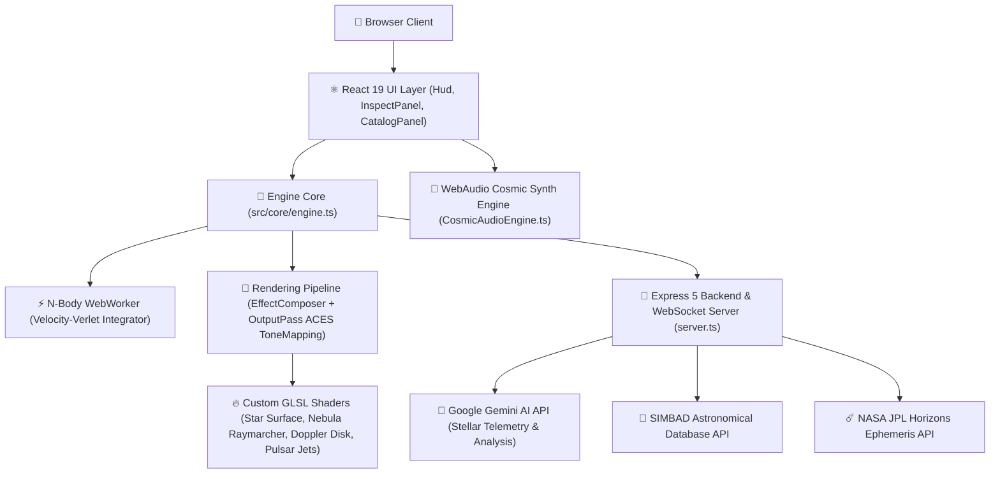

<div align="center">

</div>

<div align="center">

# ÆTHERGENESIS

**The Birth of Everything From Nothing.**

*13.8 billion years of cosmic evolution — your rules, your physics, your universe.*

[](CHANGELOG.md)
[](https://www.typescriptlang.org/)
[](https://react.dev/)
[](https://threejs.org/)
[](https://vitejs.dev/)
[](LICENSE)

</div>

---

## ✨ What is ÆTHERGENESIS?

ÆTHERGENESIS is a **physically accurate, real-time universe simulation** running entirely in your browser. Watch 500,000 stars ignite, galaxies spiral into being, comets trace Keplerian orbits, and civilizations rise and fall — all driven by real astrophysics and the fundamental constants *you* control.

Powered by **Three.js**, **WebGL/GLSL shaders**, **WebAudio synthesis**, and the **Google Gemini AI API**, it is equal parts simulation engine and interactive art installation.

---

## 🏗️ Architecture Topology



---

## 🚀 Key Features

### 🎨 Cinematic Shaders & Visuals
- 🌟 **Planckian Blackbody Star Colors** — Star surface color continuously updates via physical temperature ($T \in [2,400\text{K}, 40,000\text{K}]$) across the H-R diagram.
- ☀️ **Granulation & Sunspots** — Star surfaces feature domain-warped FBM noise, 24-octave convective solar granulation, and cell-darkened sunspots (`starSurface.frag.glsl`).
- 🌀 **Volumetric Gas Nebula** — Raymarched 3D gas cloud with emission lines, collapse dynamics, and unit-sphere scaling.
- 🕳️ **Relativistic Black Hole Accretion Disk** — Features **Doppler beaming** (approaching edge is Doppler-shifted blue and brightened $1.6\times$, receding edge is redshifted to deep crimson and dimmed $0.4\times$) and screen-space gravitational lensing distortion (`cinematic.frag.glsl`).
- ⚡ **Volumetric Pulsar Beams** — High-energy relativistic jets with 3D noise turbulence, cyan core glow, electric blue outer rims, and periodic time-dependent intensity modulation.
- 💫 **Dynamic Planet Orbit Lines** — Concentric glowing cyan trajectory line loops (`LineLoop`) rendering Keplerian planetary orbits in real time.
- 💥 **Supernova Shockwaves** — Dynamic radial UV wave displacement propagation during stellar supernova explosions.
- ✨ **Twinkling Background Stars** — Custom point shader with Gaussian radial falloff (`exp(-distSq * 14.0)`) and sinusoidal twinkling.

### 🎵 Immersive WebAudio Soundscapes
- 🛸 **Native WebAudio Ambient Synthesizer** — Zero-dependency procedural spatial soundscapes featuring multi-oscillator cosmic drones with LFO low-pass filter breathing.
- 🔊 **Stellar SFX** — Sub-bass supernova explosion bursts and subtle UI interaction clicks.
- 🔇 **HUD Audio Controls** — Instant mute/unmute toggle (`Volume2`/`VolumeX`) integrated into the HUD.

### 🤖 AI Telemetry & Real Astronomical Catalogs
- 🤖 **Gemini AI Stellar Analysis** — Click any star to open `InspectPanel` and trigger Google Gemini AI analysis for habitability scoring, civilization projections, and biome classification.
- 🔭 **Real Star Catalog & JPL Horizons Import** — Search SIMBAD TAP database, import NASA JPL Horizons small bodies (Halley, Encke, Ceres), and load famous star presets (TRAPPIST-1, Betelgeuse, Sirius A/B).

---

## 🛠️ Tech Stack

| Layer | Technology |
|-------|-----------|
| **Frontend** | React 19, TypeScript 6, Vite 8, Tailwind CSS 4 |
| **3D Rendering** | Three.js r184, WebGL, Custom GLSL Shaders |
| **Post-Processing** | Three.js `EffectComposer`, `UnrealBloomPass`, `OutputPass` (ACES Filmic) |
| **Audio** | Native WebAudio API Synthesizer |
| **Physics** | Custom Velocity Verlet N-Body Sub-Stepped Integrator (Web Worker) |
| **AI Integration** | Google Gemini API (`@google/genai`) |
| **Backend & MCP** | Express 5, WebSocket (`ws`), MCP Servers (`nasa-horizons`, `sim-state`, `stellar-catalog`) |
| **Testing** | 49-Scenario Automated E2E Test Suite |
| **Deployment** | GitHub Pages (frontend) + Render (backend) |

---

## ⚡ Getting Started

### Prerequisites

- **Node.js** v20+
- A **Gemini API key** — get one free at [aistudio.google.com](https://aistudio.google.com/apikey)

### Local Development

1. **Clone and install:**
   ```bash
   git clone https://github.com/drewdroid86/aethergenesis.git
   cd aethergenesis
   npm install
   ```

2. **Configure environment:**
   ```bash
   cp .env.example .env
   ```
   Edit `.env` and set at minimum:
   ```env
   GEMINI_API_KEY="your-key-here"
   WS_TOKEN="a-strong-random-secret"
   VITE_WS_TOKEN="same-strong-random-secret"
   ```

3. **Run full application (Vite Client + Express WS Server):**
   ```bash
   npm run dev:full
   ```
   Or run in two separate terminals:
   ```bash
   # Terminal 1 — WebSocket & API server
   npm run server

   # Terminal 2 — Vite dev server
   npm run dev
   ```

4. **Open** [http://localhost:3000](http://localhost:3000)

---

## 🧪 Testing & Quality Verification

Run the complete suite of verification commands:

```bash
# TypeScript Typecheck
npm run typecheck

# Production Bundle Build
npm run build

# Run 49-Scenario E2E Automated Integration Suite
node node_modules/tsx/dist/cli.mjs scripts/run-e2e-tests.ts
```

---

## ⌨️ Keyboard Shortcuts & HUD Controls

| Key | Action |
|-----|--------|
| `T` | Toggle timescale (Cosmic ↔ Realtime) |
| `C` | Open/close Physics Constants panel |
| `R` | Reset camera position and orientation |
| `F` | Focus camera on selected hero star |
| `Escape` | Deselect star / close InspectPanel |
| `Alt + R` | Reset simulation |
| `←` / `→` | Scrub selected star timeline |
| `Home` / `End` | Jump to start / end of stellar timeline |

> 💡 Hover over any HUD button to reveal tooltip shortcuts. Click the **Search** icon to open the Astronomical Catalog or the **Audio** icon to toggle soundscapes.

---

## 🔌 Antigravity 2.0 Plugin Integration

ÆTHERGENESIS is packaged as a native **Antigravity 2.0 Plugin** under `.agents/plugins/aethergenesis/`:

- **Manifest**: `plugin.json`
- **Agent Skills**:
  - `stellar-physics`: `skills/stellar-physics/SKILL.md`
  - `shader-optimization`: `skills/shader-optimization/SKILL.md`

AI coding assistants can invoke these skills directly during pair programming on cosmic physics or GLSL shader development.

---

## 📄 License

MIT © [drewdroid86](https://github.com/drewdroid86)
